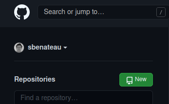
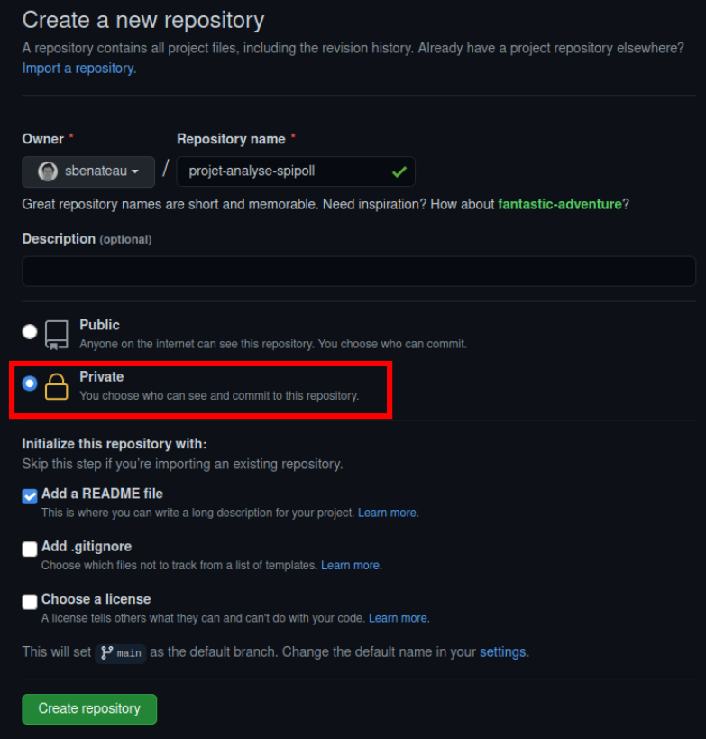
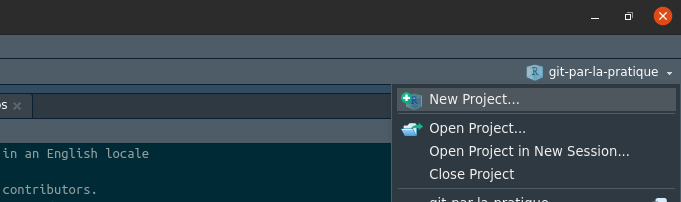
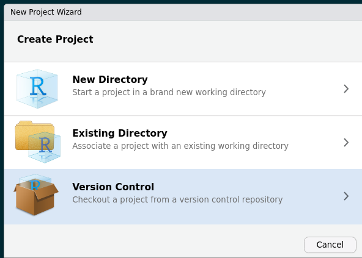
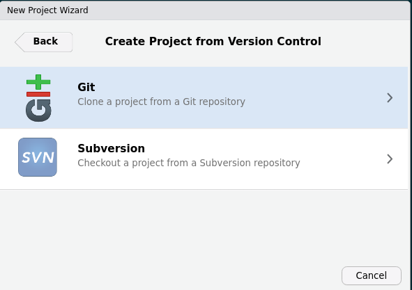
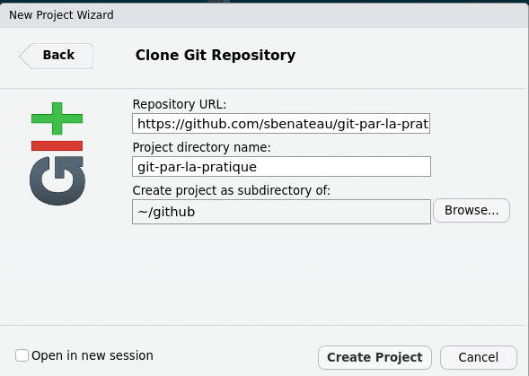
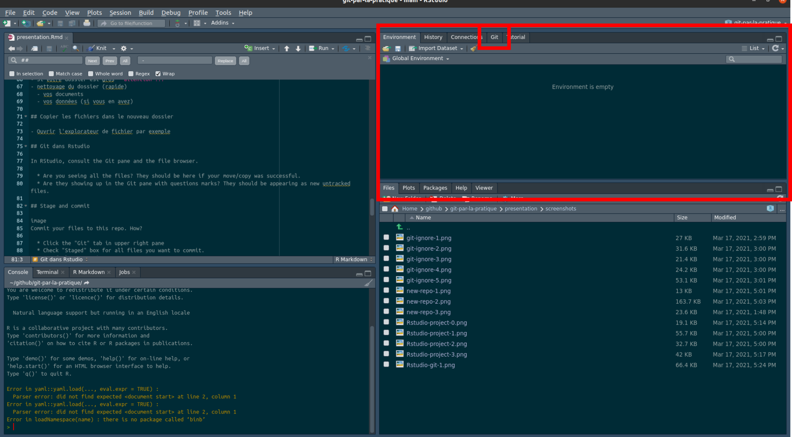
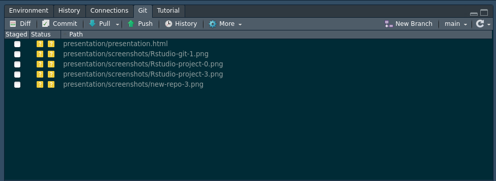

  
## Plan de la présentation

- Créer un repo sur GitHub
- Créer un projet Rstudi (git clone)
- Copier votre projet
- Faire des changements, enregistrer, et commit
- Envoyer vos changements sur GitHub


## Dites bonjour à git

Pour vérifier l'installation de git et établir la connexion :

```{r, eval = FALSE}
## install if needed (do this exactly once):
## install.packages("usethis")

library(usethis)
use_git_config(user.name = "Jane Doe", user.email = "jane@example.org")
```

## Make a repo on GitHub

Go to <https://github.com> and make sure you are logged in.

## Créer un nouveau repo



## Initialiser le nouveau repo



## Copier le lien pour cloner le repo


# New RStudio Project via git clone

## Créer un nouveau projet



## Créer un nouveau projet



## Créer un nouveau projet



## Créer un nouveau projet



## Votre dossier actuel

- Si votre dossier est gros **attention !!!**
- nettoyage du dossier (rapide)
  - vos documents
  - vos données (si vous en avez)

## Copier les fichiers dans le nouveau dossier

- Ouvrir l'explorateur de fichier par exemple

## Git dans Rstudio



## Git dans Rstudio



In RStudio, consult the Git pane and the file browser.

  * Are you seeing all the files? They should be here if your move/copy was successful.
  * Are they showing up in the Git pane with questions marks? They should be appearing as new untracked files.
  
## Stage and commit

image
Commit your files to this repo. How?

  * Click the "Git" tab in upper right pane
  * Check "Staged" box for all files you want to commit.
    - Default: stage it.
    - When to reconsider: this will all go to GitHub. So do consider if that is appropriate for each file. **You can absolutely keep a file locally, without committing it to the Git repo and sending to GitHub**. Just let it sit there in your Git pane, without being staged. No harm will be done. If this is a long-term situation, list the file in `.gitignore`.
  * If you're not already in the Git pop-up, click "Commit"
  * Type a message in "Commit message", such as "init".
  * Click "Commit"

## Push your local changes to GitHub

image
Click the green "Push" button to send your local changes to GitHub. You should see some message along these lines.

``` bash
[master dc671f0] blah
 3 files changed, 22 insertions(+)
 create mode 100644 .gitignore
 create mode 100644 myrepo.Rproj
```

## Confirm the local change propagated to the GitHub remote

Go back to the browser. I assume we're still viewing your new GitHub repo.
<https://github.com> 

Refresh.

You should see all the project files you committed there.

If you click on "commits," you should see one with the message "init".

## Faire des changements dans votre dossier

- faire des changements (commenter votre code par exemple)
- sauvegarder vos fichiers
- regarder git Diff

## si vous voulez garder ces changements

- sélectionner les fichiers à changer
- commit

## 

Now just ... repeat. Do work somewhere. Commit it. Push it or pull it\* depending on where you did it, but get local and remote "synced up". Repeat.