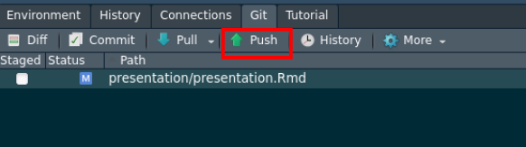

  
## Plan de la présentation

- Créer un repo sur GitHub
- Créer un projet Rstudi (git clone)
- Copier votre projet
- Faire des changements, enregistrer, et commit
- Envoyer vos changements sur GitHub


## Dites bonjour à git

Pour vérifier l'installation de git et établir la connexion :

```{r, eval = FALSE}
## install if needed (do this exactly once):
## install.packages("usethis")

library(usethis)
use_git_config(user.name = "Jane Doe", user.email = "jane@example.org")
```

## Make a repo on GitHub

Go to <https://github.com> and make sure you are logged in.

## Créer un nouveau repo


## Initialiser le nouveau repo


## Copier le lien pour cloner le repo


# New RStudio Project via git clone

## Créer un nouveau projet


## Créer un nouveau projet


## Créer un nouveau projet


## Créer un nouveau projet


## Votre dossier actuel

- Si votre dossier est gros **attention !!!**
- nettoyage du dossier (rapide)
  - vos documents
  - vos données (si vous en avez)

## Copier les fichiers dans le nouveau dossier

- Ouvrir l'explorateur de fichier par exemple

## Git dans Rstudio


## Git dans Rstudio


  
## Stage and commit


## Stage and commit


## Stage and commit


## Stage and commit


## Push your local changes to GitHub



Click the green "Push" button to send your local changes to GitHub. 

## Confirm the local change propagated to the GitHub remote

Go back to the browser. I assume we're still viewing your new GitHub repo.
<https://github.com> 

Refresh.

You should see all the project files you committed there.

If you click on "commits," you should see one with the message your wrote.

## Faire des changements dans votre dossier

- faire des changements (commenter votre code par exemple)
- sauvegarder vos fichiers
- regarder git Diff

## si vous voulez garder ces changements

- sélectionner les fichiers à changer (stage)
- regarder les changements
- commit

## Utiliser gitignore


## Utiliser gitignore


## Utiliser gitignore


## Utiliser gitignore


## Utiliser gitignore


